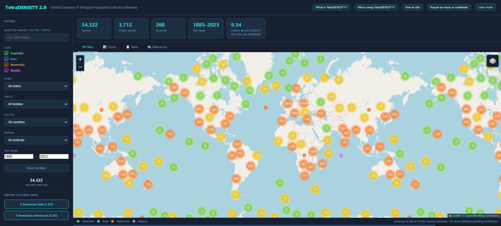
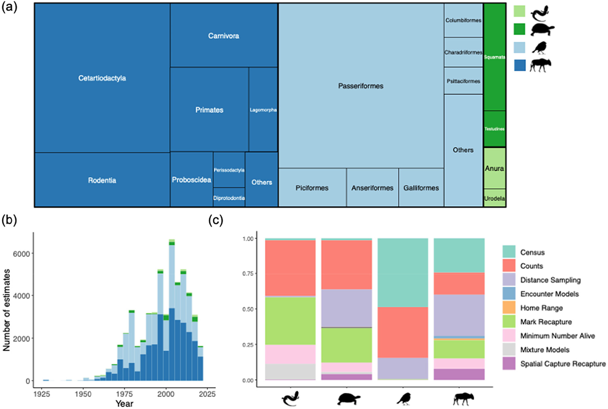

<div align="center">

# TetraDENSITY 2.0

### A Global Database of Tetrapod Population Density Estimates

[](https://andrewzamp.github.io/TetraDENSITY-2.0/)
[](https://doi.org/10.1111/geb.13929)

</div>

---

## 🌍 Explore the interactive database

> **👉 [TetraDENSITY 2.0 web app](https://andrewzamp.github.io/TetraDENSITY-2.0/)**

Filter, map, and download population density records for over **3,900 tetrapod species** across the globe. No installation required, straight in your browser.


*Figure 1. The TetraDENSITY interactive web application, allowing users to filter, map, and download tetrapod population density records directly in the browser.*

---

## What is TetraDENSITY?

**TetraDENSITY** is an open database of empirical population density estimates for the four tetrapod classes: amphibians, reptiles, birds, and mammals. It compiles density measurements from the primary scientific literature into a single, harmonised resource, enabling researchers to ask large-scale questions about how animal populations vary across species, habitats, and the planet. Its [original publication](https://doi.org/10.1111/geb.13929) was recently expanded by the [2.0 version](https://doi.org/10.1111/geb.12756), which more than doubles the number of records and almost doubles the number of species included.


*Figure 2. (a) Relative proportion of estimates by taxonomic orders of the four tetrapod classes. (b) Temporal distribution of the population estimates in the database per taxonomic class. (c) Relative abundance of different methods per taxonomic class.*

---

## Database at a glance

| | |
|---|---|
| **Total density records** | 54,323 |
| **Species covered** | 3,992 |
| **Taxonomic classes** | 4 |
| **Families** | 343 |
| **Orders** | 65 |
| **Countries / territories** | 260 |
| **Literature sources** | 2,734 |

### Records by class

| Class | Records |
|---|---:|
| 🐦 Aves (birds) | 23,663 |
| 🦣 Mammalia (mammals) | 28,067 |
| 🦎 Reptilia (reptiles) | 1,832 |
| 🐸 Amphibia (amphibians) | 761 |


*Figure 3. Geographic distribution of population density estimates in the database divided per (a) amphibians, (b) reptiles, (c) birds and (d) mammals. Hexagons’ colour represent total number of estimates in the region.*

---

## Data

The database is available directly in this repository:

| File | Description |
|---|---|
| [`data/TetraDENSITY_2.0_Database.csv`](data/TetraDENSITY_2.0_Database.csv) | Main density records |
| [`data/TetraDENSITY_2.0_References.csv`](data/TetraDENSITY_2.0_References.csv) | Full bibliography |

### Key columns in the main database

| Column | Description |
|---|---|
| `Class`, `Order`, `Family` | Taxonomy |
| `Species_rep`, `Species_COL` | Species name: both reported, and standardized to Catalogue of Life  |
| `Year` | Year of the study |
| `X`, `Y` | Longitude / latitude of the sampling site |
| `Country`, `Site` | Location descriptors |
| `Sampling_area`, `Sampling_area_unit` | Area sampled |
| `Density`, `Density_unit` | Population density estimate and units |
| `SE`, `SD`, `CI90`, `CI95`, `CV` | Uncertainty metrics |
| `Method`, `Method2` | Details on sampling and estimation methodology |
| `Native` | Whether the population is native to the site |
| `Ref_N` | Reference key (links to References file) |

---

## How to use

### In the browser
Open the **[TetraDENSITY 2.0 web app](https://andrewzamp.github.io/TetraDENSITY-2.0/)**, filter by taxonomy, period, or estimation method, explore the interactive map and charts, then download your filtered subset as a CSV.

## The paper

TetraDENSITY 2.0 is described in full in:

> **Santini, L., Mendez Angarita, V. Y., Karoulis, C., Fundarò, D., Pranzini, N., Vivaldi, C., Zhang, T., Zampetti,. A., Gargano, S. J., Mirante, D., & Paltrinieri, L. (2024).** TetraDENSITY 2.0—A database of population density estimates in TetraPods. *Global Ecology and Biogeography, 33*(12). [https://doi.org/10.1111/geb.13929](https://doi.org/10.1111/geb.13929)

---

## Citation

If you use TetraDENSITY 2.0 in your work, please cite the paper above. A BibTeX entry is provided below for convenience:

```bibtex
@article{Santini2024,
  title = {<scp>TetraDENSITY</scp> 2.0—A Database of Population Density Estimates in Tetrapods},
  volume = {33},
  ISSN = {1466-8238},
  url = {http://dx.doi.org/10.1111/geb.13929},
  DOI = {10.1111/geb.13929},
  number = {12},
  journal = {Global Ecology and Biogeography},
  publisher = {Wiley},
  author = {Santini,  L. and Mendez Angarita,  V. Y. and Karoulis,  C. and Fundarò,  D. and Pranzini,  N. and Vivaldi,  C. and Zhang,  T. and Zampetti,  A. and Gargano,  S. J. and Mirante,  D. and Paltrinieri,  L.},
  year = {2024},
  month = oct 
}
```

---

## Contributing

Spotted a missing study or an error in the data? Contributions are welcome! Please open an [issue](https://github.com/andrewzamp/TetraDENSITY/issues) or a pull request.

---

## Licence

The data are made available for academic and non-commercial use. Please refer to the published paper for the full terms of use.

---

<div align="center">
  <sub>Built and maintained by Andrea Zampetti and contributors · Powered by [GitHub Pages](https://pages.github.com/)</sub>
</div>
